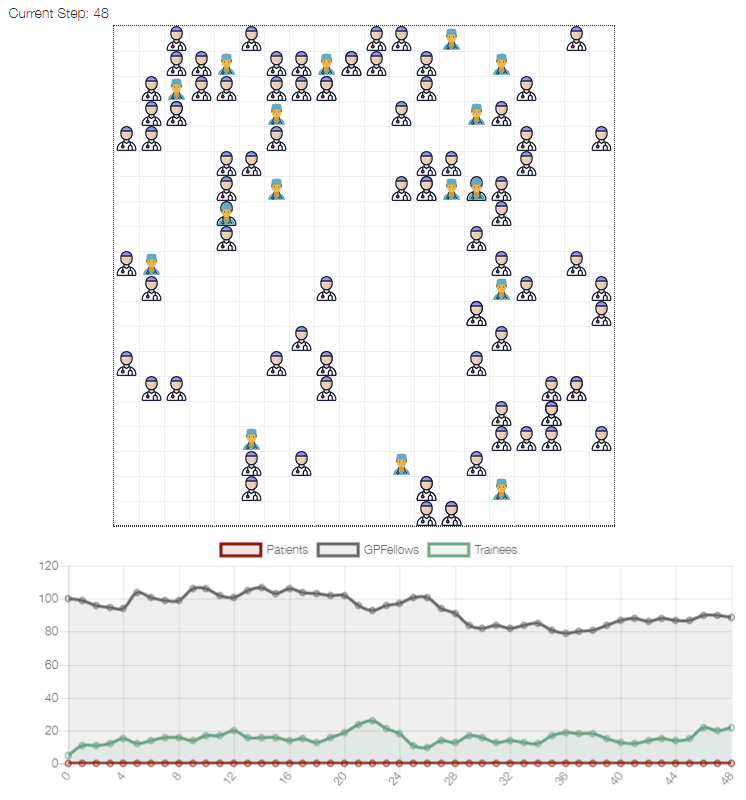

# GP Workforce Model

## Summary

A simple workforce model, consisting of three agent types: GP Fellows, Trainees, and Patients. The GP Fellows train trainees over 5 years, the Trainees then become Fellows. The GP Fellow may or may not take on another trainee.

The model is tests and demonstrates several Mesa concepts and features:
 - MultiGrid
 - Multiple agent types (GP Fellow, Trainee and Patient)
 - Overlay arbitrary text (Age and Sex of the Provider) on agent's shapes while drawing on CanvasGrid
 - Agents inheriting a behavior (random movement) from an abstract parent
 - Writing a model composed of multiple files.
 - Dynamically adding and removing agents from the schedule



## Installation

To install the dependencies use pip and the requirements.txt in this directory. e.g.

```
    $ pip install -r requirements.txt
```

## How to Run

To run the model interactively, run ``mesa runserver`` in this directory. e.g.

```
    $ mesa runserver
```

Then open your browser to [http://127.0.0.1:8521/](http://127.0.0.1:8521/) and press Reset, then Run.

## Files

* ``workforce/random_walker.py``: This defines the ``RandomWalker`` agent, which implements the behavior of moving randomly across a grid, one cell at a time. Both the Wolf and Sheep agents will inherit from it.
* ``workforce/test_random_walk.py``: Defines a simple model and a text-only visualization intended to make sure the RandomWalk class was working as expected. This doesn't actually model anything, but serves as an ad-hoc unit test. To run it, ``cd`` into the ``workforce`` directory and run ``python test_random_walk.py``. You'll see a series of ASCII grids, one per model step, with each cell showing a count of the number of agents in it.
* ``workforce/agents.py``: Defines the GP Fellow, Trainee, and Patient agent classes.
* ``workforce/schedule.py``: Defines a custom variant on the RandomActivation scheduler, where all agents of one class are activated (in random order) before the next class goes
* ``workforce/model.py``: Defines the Workforce model itself
* ``workforce/server.py``: Sets up the interactive visualization server
* ``run.py``: Launches a model visualization server.
